# Dockerising-DotNet-Apps-with-Docker
Automating the containerising and running of a .Net application with CI/CD pipeline and Github Actions. 

## Initialize Docker assets
To create the necessary docker assets to containerise the application, I would employ `docker init`.<p>
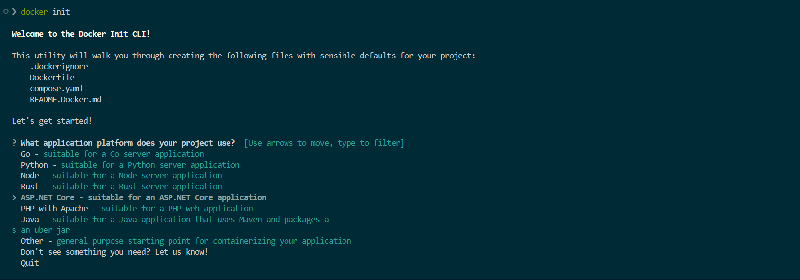 <p>
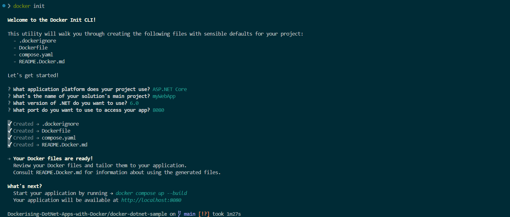<p>

The project directory now has a dockerfile, docker compose file and a .dockerignore file as below:<p>
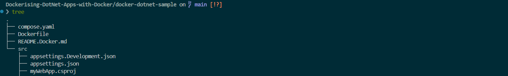

**Run The Application**:<p>
To run the application, inside the project folder I will run:

`
docker compose up --build
`  

The build time is `238.6s`<p>
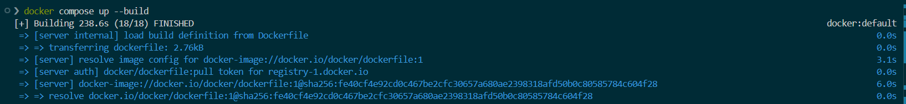

Application built and running:<p>
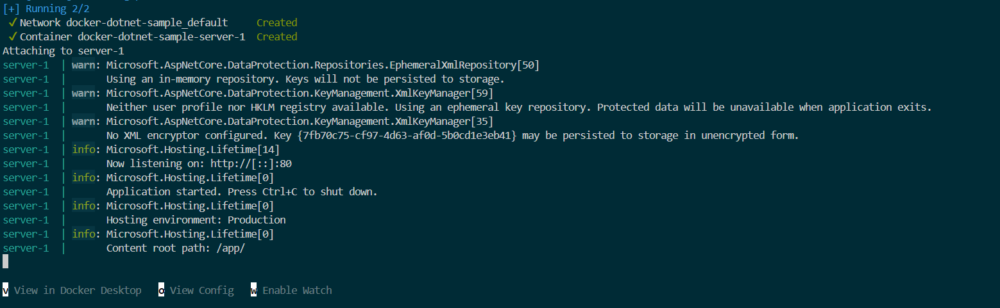

The application can be accessed on http://localhost:8080 <p>
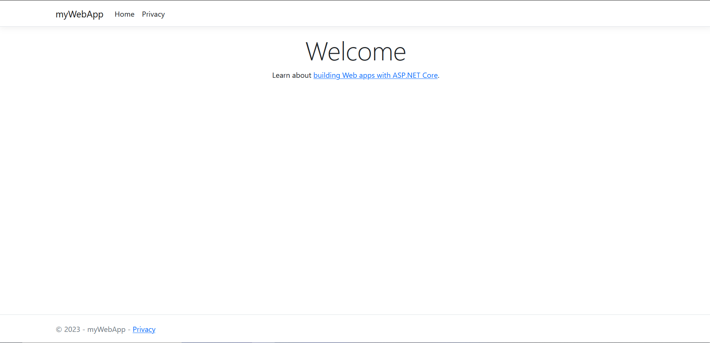

**Run The Application in the Background**<p>
To run the application in a detach mode, I will use the `-d` flag.

`
docker compose --duild -d 
`

The second build time was significanlty faster. It only `2.7s` as compared to the first build. 
This is beacuse **Docker** employed *build cache* in the second build. It checked whether it can reuse the build intruction from a previous build which it did. This is efficient as it helps **Docker** to skip unnecessary work in the second build.<p>
The layers cached and reused: <p>
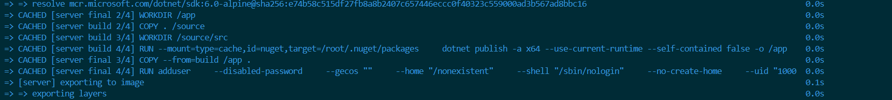<p>
When constructing the second build with Docker, a layer is reused from the build cache in the previous build if the command and its dependent files remain unchanged from the last build. This reuse accelerates the build process as Docker avoids rebuilding the unchanged layer. Hence, the significant decrease of build time. 

**Confirm build on the cli**:
To comfirm if our service, web server is built, I will run:

`
docker compose ls
`


Checking containers running: 

`
docker container ls
`


## Update The Application 

To update th .NET application:
1. Stash any previous changes. 

`
git stash -u
`

2. Checkout the new branch with to update the application. 

```
git checkout -b add-db
```

Outcome:<p>


### Add a local database and persist data
I will use a container to set up local database. This would be done by updating the compose.yaml file to define a database service and a persistent volume. This db service utilise a postgresSQL database container. 

in the main branch, the compose.yaml file had only one service, the server, configured as below:

```
services:
  server:
    build:
      context: .
      target: final
    ports:
      - 8080:80
```

Within the `Add-db` branch, the service has been updated with an addition of a db service as should below: 
```
 depends_on:
      db:
        condition: service_healthy
  db:
    image: postgres
    restart: always
    user: postgres
    secrets:
      - db-password
    volumes:
      - db-data:/var/lib/postgresql/data
    environment:
      - POSTGRES_DB=example
      - POSTGRES_PASSWORD_FILE=/run/secrets/db-password
    expose:
      - 5432
    healthcheck:
      test: [ "CMD", "pg_isready" ]
      interval: 10s
      timeout: 5s
      retries: 5
volumes:
  db-data:
secrets:
  db-password:
    file: db/password.txt
```

The full configuration would now look like this:

```
services:
  # Web Server or frontend service
  server:
    build:
      context: .
      target: final
    ports:
      - 8080:80
  # db service added
    depends_on:
      db:
        condition: service_healthy
  db:
    image: postgres
    restart: always
    user: postgres
    secrets:
      - db-password
    volumes:
      - db-data:/var/lib/postgresql/data
    environment:
      - POSTGRES_DB=example
      - POSTGRES_PASSWORD_FILE=/run/secrets/db-password
    expose:
      - 5432
    healthcheck:
      test: [ "CMD", "pg_isready" ]
      interval: 10s
      timeout: 5s
      retries: 5
volumes:
  db-data:
secrets:
  db-password:
    file: db/password.txt
```

> **Note**: The Postgres database has its password stored in a file called password.txt within db directory. 
 
**Build the Updated Applicatiocation**:

Having configured the .NET app with a local db, the new app has a db service attached to it. I will opnce again apply the new changed by running:

```
docker compose up --build
```

<p>


The new build took `13.1s`. The build time increased as compared to the last build becuase the build instruction had changed. **Docker** could not find a build history for the updated app, which is the database added. 

**Confirmed build**:<p>
Accessing web app from the internet.<p>
<p>

**Run Updated App in Detach Mode**:

Let's build the app to run in the background.
`
docker compose up --build -d 
`

The second build took only 2.6 seconds to build. Again, docker has cached the previous build and used same in the new build since configurations have not changed. <p>
<p>

Let's confirm from the command line to see the services and containers running. <p>
```
docker compose ls           # Outputs number services created

docker container ls         # Outputs number of containers running 
```
<p>
<p>

Let check the logs of the Postgres DB. This, i will run `docker compose logs -f db`.<p>

<p>

## Adding Records to the Database
From the updated web server accessed above, we could see simple wep application with the line of text, `Student name is`.  The application does not show a name because the database is empty. To resolve this, I will access the database and add records. To get to the database and run commands inside it, I will need to run `docker exec` command. The `id` of the postgres database is needed into get to the container. 

```
docker container ls    # to get the id
```
<p>

Having obtained the id of the postgres container, I can now `exec` into the container. 
```
docker exec -it a3f985971878 psql -d example -U postgres
```
<p>

Insert some records into the database:<p>

```
example=# INSERT INTO "Students" ("ID", "LastName", "FirstMidName", "EnrollmentDate") VALUES (DEFAULT, 'Jones', 'Osei', '2015-11-25');
```
<p>

## Verifying That The Data Persists in the Database
Now I will open the web app in a browser to see if the student name has now been populated. <p>
<p>

Indeed, the data has been persisted. Will the data persist if the container is accidentally removed or crashed? 
```
docker compose rm        # remove all the containers

docker compose up --build    # to run the app again
```
<p>

<p>

The data has been persisted even after removing the containers. <p>
<p>

## Automatically Updating the Services
To automatically update running Compose services, I will utilise Compose Watch. To have this functionality in the compose.yaml, I will add the Compose Watch instructions. The updated compose.yaml is below:
```
services:
  server:
    build:
      context: .
      target: final
    ports:
      - 8080:80
    depends_on:
      db:
        condition: service_healthy
    # Compose Watch added
    develop:
      watch:
        - action: rebuild
          path: .
  # db service
  db:
    image: postgres
    restart: always
    user: postgres
    secrets:
      - db-password
    volumes:
      - db-data:/var/lib/postgresql/data
    environment:
      - POSTGRES_DB=example
      - POSTGRES_PASSWORD_FILE=/run/secrets/db-password
    expose:
      - 5432
    healthcheck:
      test: [ "CMD", "pg_isready" ]
      interval: 10s
      timeout: 5s
      retries: 5
volumes:
  db-data:
secrets:
  db-password:
    file: db/password.txt
```

Running the application with `Compose Watch`:<p>
```
docker compose watch
```
<p>

Opening the web app in a browser, any changes to the application's source code or files on my local machine will now be immediately reflected in the running container. 

For example:<p>

I will make a change in `docker-dotnet-sample/src/Pages/Index.cshtml` updating the `Student name is` with `Student name:`. 

Web application before changes:<p>
<p>

After changes:

<p>

Using `Compose Watch` in development helps to make changes whiles editing and saving codes without rebulding the app from source.

## Creating a Development Container
During development, we might not need to run `dotnet publish` in the `Dockerfile`. Instead, we can utilise multi-stage builds to create separate stages for both development and production within the same Dockerfile. I will add a development stage to the Dockerfile and update the compose.yaml file to use it for local development. 

Dockerfile before update:
```
FROM --platform=$BUILDPLATFORM mcr.microsoft.com/dotnet/sdk:6.0-alpine AS build
ARG TARGETARCH

COPY . /source

WORKDIR /source/src

# Build the application.
# Leverage a cache mount to /root/.nuget/packages so that subsequent builds don't have to re-download packages.
RUN --mount=type=cache,id=nuget,target=/root/.nuget/packages \
    dotnet publish -a ${TARGETARCH/amd64/x64} --use-current-runtime --self-contained false -o /app

# Create a new stage for running the application that contains the minimal
FROM mcr.microsoft.com/dotnet/aspnet:6.0-alpine AS final
WORKDIR /app

# Copy everything needed to run the app from the "build" stage.
COPY --from=build /app .

# Create a non-privileged user that the app will run under.
ARG UID=10001
RUN adduser \
    --disabled-password \
    --gecos "" \
    --home "/nonexistent" \
    --shell "/sbin/nologin" \
    --no-create-home \
    --uid "${UID}" \
    appuser
USER appuser

ENTRYPOINT ["dotnet", "myWebApp.dll"]
```

After update:
```
FROM --platform=$BUILDPLATFORM mcr.microsoft.com/dotnet/sdk:6.0-alpine AS build
ARG TARGETARCH
COPY . /source
WORKDIR /source/src

# Build the application.
# Leverage a cache mount to /root/.nuget/packages so that subsequent builds don't have to re-download packages.
RUN --mount=type=cache,id=nuget,target=/root/.nuget/packages \
    dotnet publish -a ${TARGETARCH/amd64/x64} --use-current-runtime --self-contained false -o /app

# Added a development stage
FROM mcr.microsoft.com/dotnet/sdk:6.0-alpine AS development
COPY . /source
WORKDIR /source/src
CMD dotnet run --no-launch-profile

# Create a new stage for running the application that contains the minimal
FROM mcr.microsoft.com/dotnet/aspnet:6.0-alpine AS final
WORKDIR /app
# Copy everything needed to run the app from the "build" stage.
COPY --from=build /app .

# Create a non-privileged user that the app will run under.
ARG UID=10001
RUN adduser \
    --disabled-password \
    --gecos "" \
    --home "/nonexistent" \
    --shell "/sbin/nologin" \
    --no-create-home \
    --uid "${UID}" \
    appuser
USER appuser

ENTRYPOINT ["dotnet", "myWebApp.dll"]
```

Updating the compose.yaml file:

```
services:
  server:
    build:
      context: .
      # Updated with dev stage
      target: development
    ports:
      - 8080:80
    depends_on:
      db:
        condition: service_healthy
    develop:
      watch:
        - action: rebuild
          path: .
    # Updated with dev env 
    environment:
       - ASPNETCORE_ENVIRONMENT=Development
       - ASPNETCORE_URLS=http://+:80'
  db:
    image: postgres
    restart: always
    user: postgres
    secrets:
      - db-password
    volumes:
      - db-data:/var/lib/postgresql/data
    environment:
      - POSTGRES_DB=example
      - POSTGRES_PASSWORD_FILE=/run/secrets/db-password
    expose:
      - 5432
    healthcheck:
      test: [ "CMD", "pg_isready" ]
      interval: 10s
      timeout: 5s
      retries: 5
volumes:
  db-data:
secrets:
  db-password:
    file: db/password.txt
```
This containerised application will now include development tools like dotnet test. 

# Run .NET Tests in a Container
Running tests at dev stage is essential to identify bugs early.

## Run Tests When Developing Locally
Compose can be used to run tests locally. I will run an xUnit test inside a container.

```
docker compose run --build --rm server dotnet test /source/tests
```
Test completed with these results: <p>
<p>

## Run Test when Building with Dockerfile
In the Dockerfile, I will run the test in an exisiting build stage. Updating the Dockerfile:

```
FROM --platform=$BUILDPLATFORM mcr.microsoft.com/dotnet/sdk:6.0-alpine AS build
ARG TARGETARCH
COPY . /source
WORKDIR /source/src
# Build the application.
# Leverage a cache mount to /root/.nuget/packages so that subsequent builds don't have to re-download packages.
RUN --mount=type=cache,id=nuget,target=/root/.nuget/packages \
    dotnet publish -a ${TARGETARCH/amd64/x64} --use-current-runtime --self-contained false -o /app
# Run test
RUN dotnet test /source/tests

# Added a development stage
FROM mcr.microsoft.com/dotnet/sdk:6.0-alpine AS development
COPY . /source
WORKDIR /source/src
CMD dotnet run --no-launch-profile

# Create a new stage for running the application that contains the minimal
FROM mcr.microsoft.com/dotnet/aspnet:6.0-alpine AS final
WORKDIR /app
# Copy everything needed to run the app from the "build" stage.
COPY --from=build /app .

# Create a non-privileged user that the app will run under.
ARG UID=10001
RUN adduser \
    --disabled-password \
    --gecos "" \
    --home "/nonexistent" \
    --shell "/sbin/nologin" \
    --no-create-home \
    --uid "${UID}" \
    appuser
USER appuser

ENTRYPOINT ["dotnet", "myWebApp.dll"]
```

Let's build and run the test:<p>
```
 docker build -t dotnet-docker-image-test --progress=plain --no-cache --target build .
```

<p>


The test has been successful whiles building the image. If there were any problems, we could mitigate it at dev stage. 

## Automate Build with Github Actions and CI/CD

Here, I will configure and build the web app image with Github Actions. Automating the build reduce human errors and decrease build time as this process streamlines build, test and push to a repository. 

### Set Up Workflow 

1. In a .github folder, I will create an action.yml file in a folder called workflows
2. Configure the action.yml file for the workflows.

```
name: ci

on:
  push:
    branches:
      - main

jobs:
  build:
    runs-on: ubuntu-latest
    steps:
      -
        name: Login to Docker Hub
        uses: docker/login-action@v3
        with:
          # credentials here
          username: ${{ vars.DOCKER_USERNAME }}
          password: ${{ secrets.DOCKERHUB_TOKEN }}
      -
        name: Set up Docker Buildx
        uses: docker/setup-buildx-action@v3
      -
        name: Build and test
        uses: docker/build-push-action@v6
        with:
          target: build
          load: true
      -
        name: Build and push
        uses: docker/build-push-action@v6
        with:
          platforms: linux/amd64,linux/arm64
          push: true
          target: final
          tags: ${{ vars.DOCKER_USERNAME }}/${{ github.event.repository.name }}:latest
```
3. Run the workflow. 
The workflows have run successfully.<p>
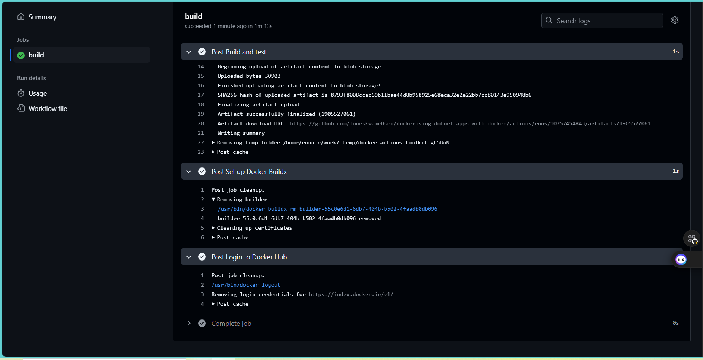

Let's confirm if the image had been built and push to my repo in Dockerhub.<p>

Image built and pushed to dockerhub repo.<p>
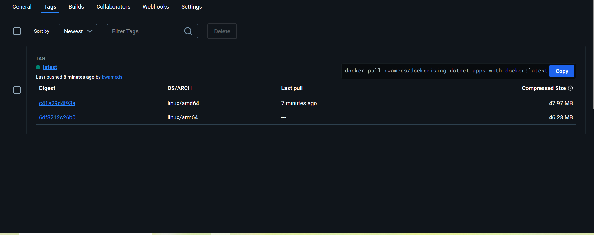

## Test The .NET Deployment with Kubernetes
To test and debug the image built, I will utilised kubernetes locally deploy it.  

### Create a Kubernetes Configurations 
In the project directopry, I will created a file named docker-kubernetes-dotnet.yml. Configured as follows:

```
apiVersion: apps/v1
kind: Deployment
metadata:
  labels:
    service: server
  name: server
  namespace: default
spec:
  replicas: 1
  selector:
    matchLabels:
      service: server
  strategy: {}
  template:
    metadata:
      labels:
        service: server
    spec:
      initContainers:
        - name: wait-for-db
          image: busybox:1.28
          command: ['sh', '-c', 'until nc -zv db 5432; do echo "waiting for db"; sleep 2; done;']
      containers:
        - image: kwameds/dockerising-dotnet-apps-with-docker:latest
          name: server
          imagePullPolicy: Always
          ports:
            - containerPort: 80
              hostPort: 8080
              protocol: TCP
          resources: {}
      restartPolicy: Always
status: {}
---
apiVersion: apps/v1
kind: Deployment
metadata:
  labels:
    service: db
  name: db
  namespace: default
spec:
  replicas: 1
  selector:
    matchLabels:
      service: db
  strategy:
    type: Recreate
  template:
    metadata:
      labels:
        service: db
    spec:
      containers:
        - env:
            - name: POSTGRES_DB
              valueFrom:
                secretKeyRef:
                  name: mysql-user
                  key: username
            - name: POSTGRES_PASSWORD
              valueFrom:
                secretKeyRef:
                  name: mysql-pass
                  key: password
          image: postgres
          name: db
          ports:
            - containerPort: 5432
              protocol: TCP
          resources: {}
      restartPolicy: Always
status: {}
---
apiVersion: v1
kind: Service
metadata:
  labels:
    service: server
  name: server
  namespace: default
spec:
  type: NodePort
  ports:
    - name: "8080"
      port: 8080
      targetPort: 80
      nodePort: 30001
  selector:
    service: server
status:
  loadBalancer: {}
---
apiVersion: v1
kind: Service
metadata:
  labels:
    service: db
  name: db
  namespace: default
spec:
  ports:
    - name: "5432"
      port: 5432
      targetPort: 5432
  selector:
    service: db
status:
  loadBalancer: {}
```

I utilised `kustomize` to create secrets for the db credentials instead of hardcoding the username and the password. Also in the kustomize yml file, I referenced the kubernetes file source. Then applied the kustomization.yml to create all resoureces. 
```
secretGenerator:
  - name: mysql-pass
    literals:
    - password=********
  - name: mysql-user
    literals:
    - username=xxxxxx
resources:
  - docker-kubernetes-dotnet.yml
```
### Apply The configurations
To apply the configurations, Iwill run:<p>
```
k apply -k ./      # k is an alias for kubectl and -k is the kustomize file
```
> Output:

```
❯ k apply -k ./ 
secret/mysql-pass-845mkcm2cd created
secret/mysql-user-hf288g282f created
service/db created
service/server created
deployment.apps/db created
deployment.apps/server created
```

Let's get the secrets created:
```
k get secrets
```

> Output:

```
❯ k get secrets 
NAME                    TYPE     DATA   AGE
mysql-pass-845mkcm2cd   Opaque   1      51s
mysql-user-hf288g282f   Opaque   1      51s
```

Confirm deployments: 
```
k get deploy
```
> Outputs:

```
❯ k get deploy  
NAME     READY   UP-TO-DATE   AVAILABLE   AGE
db       1/1     1            1           86s
server   1/1     1            1           86s
```

Fetch Pods created:
```
k get pods
```
> Output:

```
❯ k get pods   
NAME                     READY   STATUS    RESTARTS   AGE
db-8664df4546-gwg2z      1/1     Running   0          16m
server-bc9cdfcbf-2dw22   1/1     Running   0          16m
```

We can also get the services:
```
k get services
```
> Output:
>

```
❯ k get services 
NAME         TYPE        CLUSTER-IP     EXTERNAL-IP   PORT(S)          AGE
db           ClusterIP   10.99.204.96   <none>        5432/TCP         18m
kubernetes   ClusterIP   10.96.0.1      <none>        443/TCP          36h
server       NodePort    10.96.21.136   <none>        8080:30001/TCP   18m
```

### Access Deployments on Kubernetes Dashboard
To access the kubernetes UI, I need to install with helm by running:
```
helm upgrade --install kubernetes-dashboard kubernetes-dashboard/kubernetes-dashboard --create-namespace --namespace kubernetes-dashboard
```
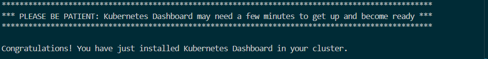

Get Dashboard Pods by running:

```
k get pods -n kubernetes-dashboard
```
> Output:
>

```
❯ k get pods -n kubernetes-dashboard
NAME                                                    READY   STATUS    RESTARTS   AGE
kubernetes-dashboard-api-787494d7c7-jdww5               1/1     Running   0          6m9s
kubernetes-dashboard-auth-7fd7c76cc5-fkfpr              1/1     Running   0          6m9s
kubernetes-dashboard-kong-7696bb8c88-p4s49              1/1     Running   0          6m9s
kubernetes-dashboard-metrics-scraper-5485b64c47-v56dh   1/1     Running   0          6m9s
kubernetes-dashboard-web-84f8d6fff4-8c4d7               1/1     Running   0          6m9s
```
Deployments:<p>
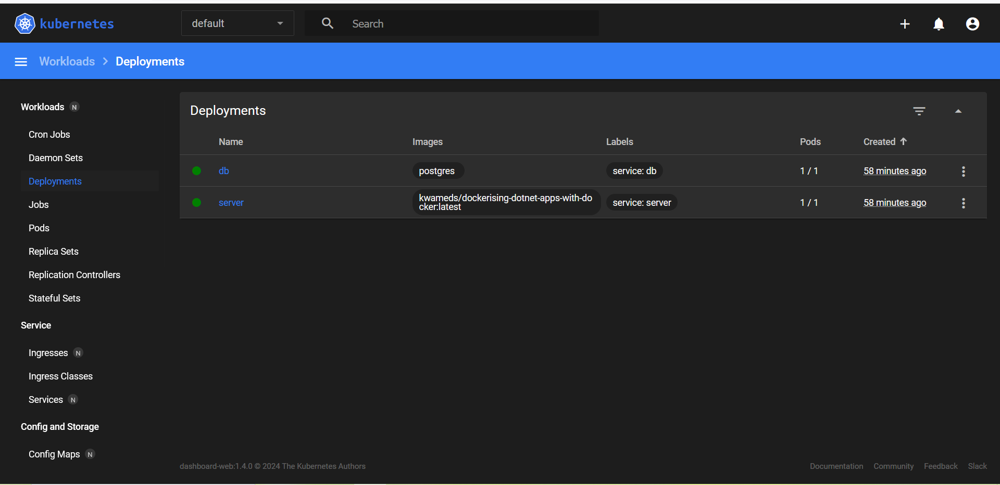

Pods:<p>
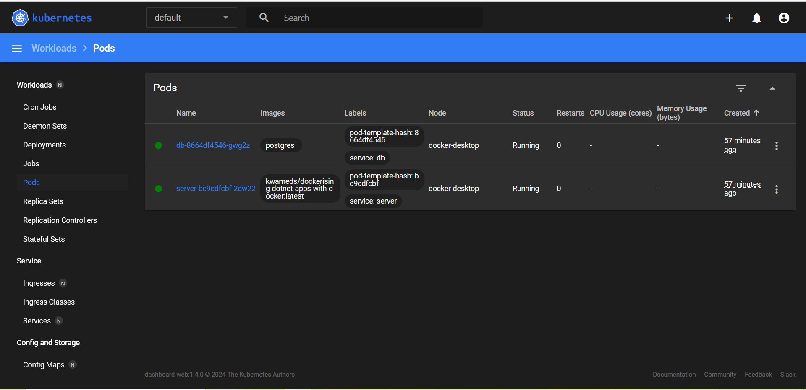

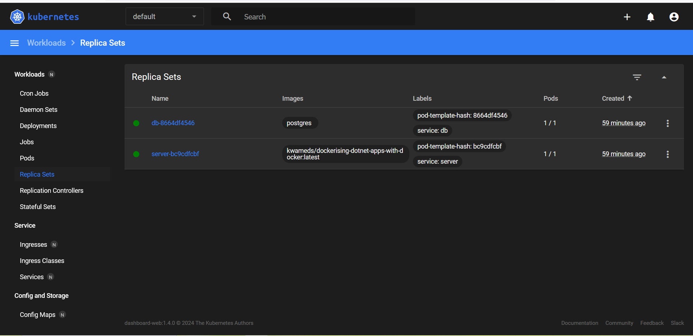

DB logs:<p>
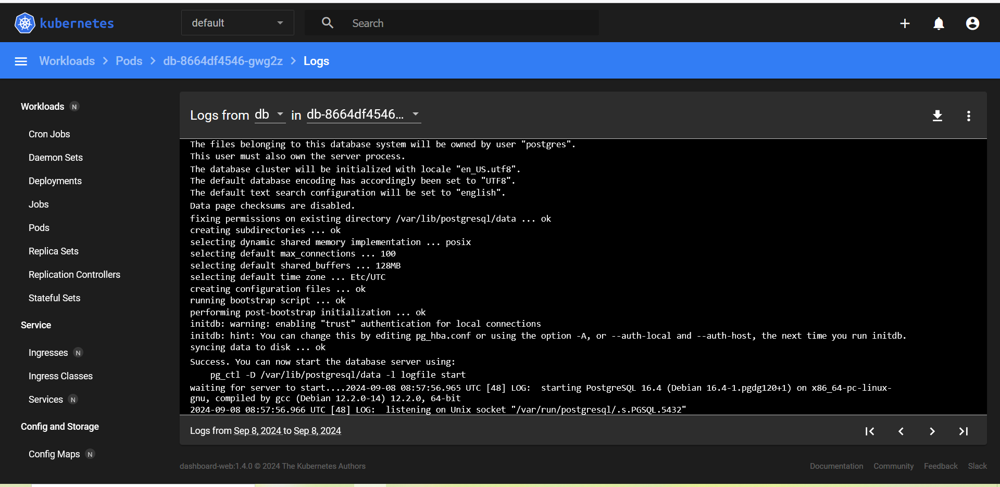

# Monitor Deployment
I will leverage `grafana cloud` to monitor application application, CPU and memory resources. To use grafana cloud, I will utilise a a helm chart to configure the monitoring the containers and other resources. 

## Access grafana on the browser 
<p>

Observing the resources available and usage, from the dashboard above the node has a total of 16 cores. However, the average usage is low, at approximately 0.468 cores, peaking at 0.670 cores. This is significantly below the total available capacity, suggesting underutilisation.

In the case of memory, the utilisation is low as it averaging around 3.5 GiB, peaking at 3.67 GiB. 

For cost implication, gievin the low utilisation of resource, the current osts of CPU and Memory are minimal. In a production environment, although low cost should be maintained, lower utilisation near zero should be a concern to the team. This can be the issue of pods being iddle. 

# Conclusion
In this Docker hands-on project, I have demonstrated how Docker can be used to develop and containerise a .NET application. Also, showed how to add a local database as a container and persist data as well as using `Compose Watch` to automatically rebuild and run a container when the source code is updated. Again, I exhibited how tests are utilised in the development environment to mitigate bugs early using `Compose`. All these were put together in an automation with Github Actions to build, run tests and push image to Dockerhub repo and finally, I demonstrated how to use Docker Desktop to deploy your application to a fully-featured Kubernetes environment on your development machine.


