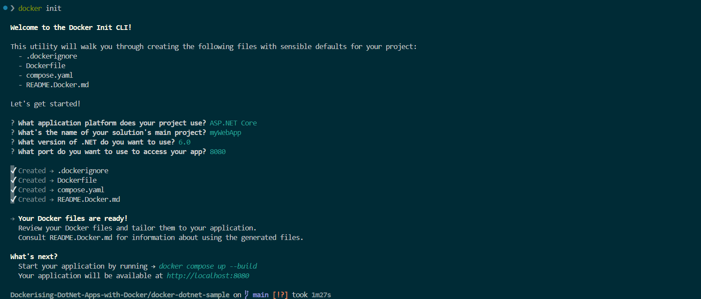
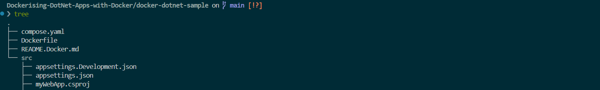
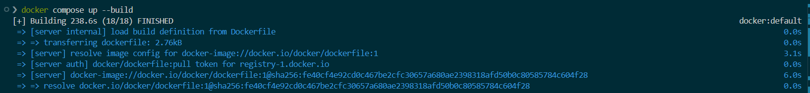
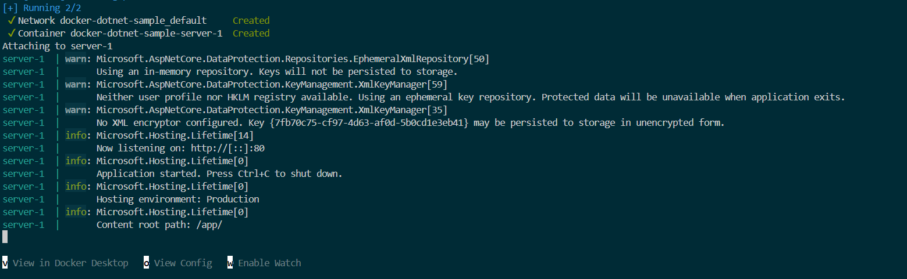
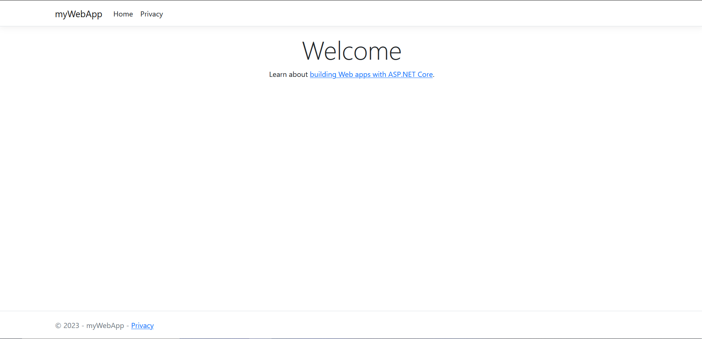
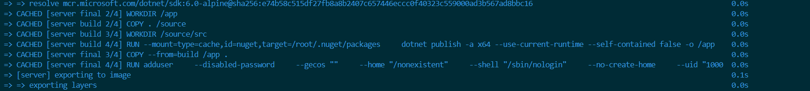

# Dockerising-DotNet-Apps-with-Docker
Automating the containerising and running of a .Net application with CI/CD pipeline and Github Actions. 

## Initialize Docker assets
To create the necessary docker assets to containerise the application, I would employ `docker init`.

 

The project directory now has a dockerfile, docker compose file and a .dockerignore file as below:

**Run The Application**:

To run the application, inside the project folder I will run:

`
docker compose up --build
`  

The build time is `238.6s`

Application built and running:

The application can be accessed on http://localhost:8080 

**Run The Application in the Background**

To run the application in a detach mode, I will use the `-d` flag.

`
docker compose --duild -d 
`

The second build time was significanlty faster. It only `2.7s` as compared to the first build. 
This is beacuse **Docker** employed *build cache* in the second build. It checked whether it can reuse the build intruction from a previous build which it did. This is efficient as it helps **Docker** to skip unnecessary work in the second build.

The layers cached and reused: 

When constructing the second build with Docker, a layer is reused from the build cache in the previous build if the command and its dependent files remain unchanged from the last build. This reuse accelerates the build process as Docker avoids rebuilding the unchanged layer. Hence, the significant decrease of build time. 

## Update The Application 

To update th .NET application:
1. Stash any previous changes. 

`
git stash -u
`

2. Checkout the new branch with to update the application. 

`
git checkout -b add-db
`
### Add a local database and persist data
I will use a container to set up local database. This would be done by updating the compose.yaml file to define a database service and a persistent volume. This db service utilise a postgresSQL database container. 

**Build the Updated Applicatiocation**:

Having configured the .NET app with a local db, the new app has a db service attached to it. I will opnce again apply the new changed by running:

`
docker compose up --build
`

`
❯ docker compose up --build    
Found existing alias for "docker compose up --build". You should use: "dcupb"
[+] Running 15/1
 ✔ db Pulled                                                                   136.7s 
[+] Building 7.2s (18/18) FINISHED                                     docker:default
 => [server internal] load build definition from Dockerfile                      0.0s
 => => transferring dockerfile: 2.76kB                                           0.0s
 => [server] resolve image config for docker-image://docker.io/docker/dockerfil  1.7s
 => [server auth] docker/dockerfile:pull token for registry-1.docker.io          0.0s
 => CACHED [server] docker-image://docker.io/docker/dockerfile:1@sha256:fe40cf4  0.0s
`
The new build took `136s`. The build time increased becuase there build instruction had changed. **Docker** could not find a build history for the updated app, which is the database added. 

**Confirmed build**:

`
[+] Running 3/2
 ✔ Volume "docker-dotnet-sample_db-data"    Created                              0.0s 
 ✔ Container docker-dotnet-sample-db-1      Created                              0.1s 
 ✔ Container docker-dotnet-sample-server-1  Recreated                            0.1s 
Attaching to db-1, server-1
db-1      | The files belonging to this database system will be owned by user "postgres".
db-1      | This user must also own the server process.
db-1      | 
db-1      | The database cluster will be initialized with locale "en_US.utf8".
db-1      | The default database encoding has accordingly been set to "UTF8".
db-1      | The default text search configuration will be set to "english".
`

**Run Updated App in Detach Mode**:

Let's build the app to run in the background.
`
docker compose up --build -d 
`

The second build took only 2.4 seconds to build. Again, docker has cached the previous build and used same in the new build since configurations have not changed. 

`
❯ docker compose up --build -d 
Found existing alias for "docker compose up --build". You should use: "dcupb"
[+] Building 2.4s (18/18) FINISHED                                                            docker:default
 => [server internal] load build definition from Dockerfile                                             0.0s
 => => transferring dockerfile: 2.76kB                                                                  0.0s
 => [server] resolve image config for docker-image://docker.io/docker/dockerfile:1                      1.4s
 => [server auth] docker/dockerfile:pull token for registry-1.docker.io                                 0.0s
 => CACHED [server] docker-image://docker.io/docker/dockerfile:1@sha256:fe40cf4e92cd0c467be2cfc30657a6  0.0s
 => => resolve docker.io/docker/dockerfile:1@sha256:fe40cf4e92cd0c467be2cfc30657a680ae2398318afd50b0c8  0.0s
 => [server internal] load metadata for mcr.microsoft.com/dotnet/aspnet:6.0-alpine                      0.7s
 => [server internal] load metadata for mcr.microsoft.com/dotnet/sdk:6.0-alpine                         0.8s
 => [server internal] load .dockerignore                                                                0.0s
 => => transferring context: 647B                                                                       0.0s
 => [server internal] load build context                                                                0.0s
 => => transferring context: 6.12kB                                                                     0.0s
 => [server final 1/4] FROM mcr.microsoft.com/dotnet/aspnet:6.0-alpine@sha256:e6a319484e755a1c5a6a191c  0.0s
 => => resolve mcr.microsoft.com/dotnet/aspnet:6.0-alpine@sha256:e6a319484e755a1c5a6a191c3d7445806a711  0.0s
 => [server build 1/4] FROM mcr.microsoft.com/dotnet/sdk:6.0-alpine@sha256:e74b58c515df27fb8a8b2407c65  0.0s
 => => resolve mcr.microsoft.com/dotnet/sdk:6.0-alpine@sha256:e74b58c515df27fb8a8b2407c657446eccc0f403  0.0s
 => CACHED [server final 2/4] WORKDIR /app                                                              0.0s
 => CACHED [server build 2/4] COPY . /source                                                            0.0s
 => CACHED [server build 3/4] WORKDIR /source/src                                                       0.0s
 => CACHED [server build 4/4] RUN --mount=type=cache,id=nuget,target=/root/.nuget/packages     dotnet   0.0s
 => CACHED [server final 3/4] COPY --from=build /app .                                                  0.0s
 => CACHED [server final 4/4] RUN adduser     --disabled-password     --gecos ""     --home "/nonexist  0.0s
 => [server] exporting to image                                                                         0.0s
 => => exporting layers                                                                                 0.0s
 => => exporting manifest sha256:9ccf2bd36f0f7e1a0f91db199f6fff726bd379c0eebe5fafb51d4bd6d62fcfb5       0.0s
 => => exporting config sha256:7739b0fd0b51d8244f9fd61429f55baa441ed926cab90079327ef615fc84db2f         0.0s
 => => exporting attestation manifest sha256:51676a7303ec19ef0502d8fd2aef946aa59a743981407510367f252d6  0.0s
 => => exporting manifest list sha256:565733a9df08a735c00e7723e9a30baa7e524b9b3d3545adae382c8e794cd374  0.0s
 => => naming to docker.io/library/docker-dotnet-sample-server:latest                                   0.0s
 => => unpacking to docker.io/library/docker-dotnet-sample-server:latest                                0.0s
 => [server] resolving provenance for metadata file                                                     0.0s
[+] Running 2/2
 ✔ Container docker-dotnet-sample-db-1      Healthy                                                    11.0s 
 ✔ Container docker-dotnet-sample-server-1  Started                                                   3s                                                                                  0.0s
`

Let's confirm from the command line to see the containers running. I will run `docker compose ls`.

`
❯ docker compose ls           
Found existing alias for "docker compose". You should use: "dco"
NAME                   STATUS              CONFIG FILES
docker-dotnet-sample   running(2)          /home/jones/Dockerising-DotNet-Apps-with-Docker/docker-dotnet-sample/compose.yaml
`

To see all the containers, I will run ` docker container ls`.

`
❯ docker container ls      
Found existing alias for "docker container ls". You should use: "dcls"
CONTAINER ID   IMAGE                         COMMAND                  CREATED          STATUS                    PORTS                  NAMES
3fbfcea4c5a2   docker-dotnet-sample-server   "dotnet myWebApp.dll"    15 minutes ago   Up 15 minutes             0.0.0.0:8080->80/tcp   docker-dotnet-sample-server-1
624ceeac9ff3   postgres                      "docker-entrypoint.s…"   53 minutes ago   Up 15 minutes (healthy)   5432/tcp               docker-dotnet-sample-db-1
`
Let check the logs of the Postgres DB. This, i will run `docker compose logs -f db`

`
❯ docker compose logs -f db
Found existing alias for "docker compose logs -f". You should use: "dclf"
db-1  | The files belonging to this database system will be owned by user "postgres".
db-1  | This user must also own the server process.
db-1  | 
db-1  | The database cluster will be initialized with locale "en_US.utf8".
db-1  | The default database encoding has accordingly been set to "UTF8".
db-1  | The default text search configuration will be set to "english".
db-1  | 
db-1  | Data page checksums are disabled.
db-1  | 
db-1  | fixing permissions on existing directory /var/lib/postgresql/data ... ok
db-1  | creating subdirectories ... ok
db-1  | selecting dynamic shared memory implementation ... posix
db-1  | selecting default max_connections ... 100
db-1  | selecting default shared_buffers ... 128MB
db-1  | selecting default time zone ... Etc/UTC
db-1  | creating configuration files ... ok
db-1  | running bootstrap script ... ok
db-1  | performing post-bootstrap initialization ... ok
db-1  | initdb: warning: enabling "trust" authentication for local connections
db-1  | initdb: hint: You can change this by editing pg_hba.conf or using the option -A, or --auth-local and --auth-host, the next time you run initdb.
db-1  | syncing data to disk ... ok
db-1  | 
db-1  | 
db-1  | Success. You can now start the database server using:
db-1  | 
db-1  |     pg_ctl -D /var/lib/postgresql/data -l logfile start
db-1  | 
`

